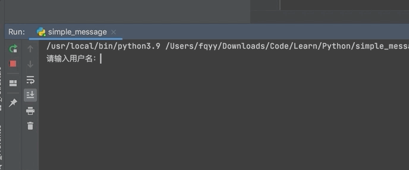

[toc]

&emsp;&emsp;用户交互就是人往计算机中输入数据（input）、计算机输出结果（print），从而使得计算机能够像人一样与用户沟通交流，<font color=red> *__交互的本质就是输入、输出__* </font>。

# input输入

&emsp;&emsp;在python3中<font color=red> *__input__* </font>会等待用户输入，<font color=red> *__它会让程序暂停运行并等待用户输入一些文本__* </font>，用户输入任何内容都会存成字符串类型，然后赋值给等号左边的变量名。input接受一个参数用来向用户显示提示或者说明信息：

```python
username = input("请输入用户名：") 
print(username)
```

&emsp;&emsp;程序运行的效果如下图：



> <font color=orange>*__注意：__*</font>
> 1. 在python2中存在一个 raw_input ，它的功能与python3中的input功能一模一样
> 2. 在python2中还存在一个input功能，需要用户输入一个明确的数据类型，输入什么类型就存成什么类型

# print输出
## 基本用法

&emsp;&emsp;print可以只输出一个值，也可以一次性输出多个值，值用逗号隔开：

```python
# 输出一个值 
print("Hello")          # Hello 
# 输出多个值 
print("Hello", "World") # Hello World
```

&emsp;&emsp;print功能有一个end参数，该参数的默认值为 "\n”（代表换行），可以将end参数的值改成任意其它字符：

```python
print("Hello", end="-") 
print("World") # 输出 Hello-World
```

## 格式化输出
### %号

&emsp;&emsp;%号格式化字符串的方式从Python诞生之初就已经存在，它的基本用法如下：

```python
# 声明一个变量 
age = 18 
message = "我的名字叫 %s，我今年 %d 岁了" % ("Tom", age)
print(message)  
# 我的名字叫 Tom，我今年 18 岁了
```

+ <font color=green>**%d：** </font>只能接受为整型
+ <font color=green>**%s：**</font> 可以接受任何类型

&emsp;&emsp;所以上面的案例中都使用 %s 也是可以的：

```python
# 声明一个变量 
age = 18 
print("我的名字叫 %s，我今年 %s 岁了" % ("Tom", age))  
# 我的名字叫 Tom，我今年 18 岁了
```

&emsp;&emsp;如果只有一个值那么（）可以省略不写：

```python
print("我的名字叫 %s" % "Tom")  # 我的名字叫 Tom
```

&emsp;&emsp;格式的字符串（即%d或者%s）与被格式化的字符串（即传入的值）必须按照位置一一对应（少一个不行，多一个也不行）：

```python
print("numer1: %s, number2 : %s, number3: %s" % (1, 2)) 
# TypeError: not enough arguments for format string 

print("numer1: %s, number2 : %s, number3: %s" % (1, 2, 3, 4)) 
# TypeError: not all arguments converted during string formatting
```

&emsp;&emsp;当需要格式化的字符串过多的时候位置极容易搞混，%号还可以通过字典方式格式化，这样就解决了使用位置带来的限制与困扰：

```python
# 下面两个都输出 ： 我的名字叫 Tom , 我今年 18 岁了 
print("我的名字叫 %(name)s , 我今年 %(age)s 岁了" % {'name': 'Tom', 'age': 18})
 
# 也可以传入字典 
user = {     
	'name': 'Tom',     
	'age' : 18 
} 
print("我的名字叫 %(name)s , 我今年 %(age)s 岁了" % user)
```

&emsp;&emsp;如果要输出%号，可以在%号前面再加上一个%：

```python
print("%s%%" % 20)       # 20%
```

> <font color=orange>*__注意：__* </font>不推荐使用这种方法格式化字符串。

### str.format

&emsp;&emsp;format方法是在Python 2.6中引入的，它是字符串类型的内置方法。

<font color=orachid>**1. 使用位置参数**</font>

&emsp;&emsp;format也可以按照位置一一对应：

```python
# 我的名字叫 Tom , 我今年 18 岁了 
print("我的名字叫 {} , 我今年 {} 岁了".format("Tom", 18))
```

<font color=orachid>**2. 使用索引**</font>

&emsp;&emsp;format还可以按照索引取对应位置的值，这样一个位置上的值可以重复使用：

```python
# 我的名字叫 Tom , 我今年 18 岁了。我的名字也叫 Tom, 我今年也 18 岁了 
print("我的名字叫 {0} , 我今年 {1} 岁了。我的名字也叫 {0}, 我今年也 {1} 岁了".format("Tom", 18))
```

<font color=orachid>**3. 使用关键字参数或者字典**</font>

&emsp;&emsp;可以通过关键字或者字典方式格式化，这样就解决了位置带来的限制与困扰：

```python
# 我的名字叫 Tom , 我今年 18 岁了 
print("我的名字叫 {name} , 我今年 {age} 岁了".format(name="Tom", age=18)) 

# 也可以使用字典 
user = {     
	"name": "Tom",     
	"age": 18 
} 
# 使用**进行解包操作 
print("我的名字叫 {name} , 我今年 {age} 岁了".format(**user))
```

<font color=orachid>**4. 字符串填充**</font>

&emsp;&emsp;可以使用format方法对字符串进行填充，从而实现字符串的对齐：

```python
# 字符串的左对齐 
print("{0:*<10}".format("Hello"))   # Hello***** 
# 字符串的右对齐 
print("{0:*>10}".format("Hello"))   # *****Hello 
# 字符串的中心对齐 
print("{0:*^10}".format("Hello"))   # **Hello***
```

<font color=orachid>**5. 进度与进制**</font>

&emsp;&emsp;可以使用format方法实现精确小数的位数：

```python
# 精确到小数点后3位，四舍五入 
print("{salary:.3f}".format(salary=1000.35678)) # 1000.357
```

&emsp;&emsp;还可以实现进制转换：

```python
print('{0:b}'.format(12))  # 转成二进制，结果为：1100 
print('{0:o}'.format(12))  # 转成八进制，结果为：14 
print('{0:x}'.format(12))  # 转成十六进制，结果为：c
```

&emsp;&emsp;还可以实现数字的格式化：

```python
# 千分位格式化 
print('{0:,}'.format(99812939393931))  # 99,812,939,393,931
```

> <font color=orange>*__注意：__*</font>因为str.format的方式在性能和使用的灵活性上都比%号更胜一筹，所以推荐使用。

### f-string

&emsp;&emsp;在 Python 3.6 中引入了f-strings，该方法不仅比str.format更简洁，而且性能上也更胜一筹。f-string 是以f或F开头的字符串， 核心在于字符串中符号{}的使用：

```python
# 使用变量名 
age = 18 
name = "Tom" 
print(f"我的名字叫 {name}, 我今年 {age} 岁") # 我的名字叫 Tom, 我今年 18 岁
```

&emsp;&emsp;{}中不仅仅可以放变量，还可以放置任意合法的Python表达式：

```python
# 放置数学表达式 
print(f"1 + 2 = {1 + 2}")  #  1 + 2 = 3 

# 放置函数 
def sum(num1, num2):     
	return num1 + num2 

	
print(f"1 + 2 = {sum(1, 2)}")   # 1 + 2 = 3
```

&emsp;&emsp;当格式化字符串过长时可以回车分隔到多行，注意每行前都有一个f：

```python
name = "Tom" 
age = 18 
gender = 'man' 
info = [     
	f'名字：{name}'     
	f'年龄：{age}'     
	f'性别：{gender}'
] 
print(info) # ['名字：Tom年龄：18性别：man']
```

&emsp;&emsp;如果想要输出{}，那么需要在原有的基础上再套一层{}，如：

```python
message = "Hello Wolrd" 
print(f"{{message}}")       # {message}
```

### 标准库

&emsp;&emsp;从Python 2.4起，Python标准库string引入了Template也可以用来格式化字符串：

```python
name = 'Tom'
age = 18
t = Template("My name is $name, I'm $age years old")
print(t.substitute(name= name, age = age))
# My name is Tom, I'm 18 years old
```

&emsp;&emsp;使用模板字符串Template的最佳的时机就是当你的程序需要处理由用户提供的输入内容，模板字符串是最保险的选择，因为可以降低复杂性，其它一些复杂的字符串格式化技巧的可能会给你的程序带来安全漏洞。

### 总结四种方式的应用场景

+ 如果格式化的字符串是由用户输入的，那么基于安全性考虑，推荐使用Template
+ 如果使用的python3.6+版本的解释器，推荐使用f-Stings
+ 如果要兼容python2.x版本的python解释器，推荐使用str.format
+ 如果不是测试的代码，不推荐使用%