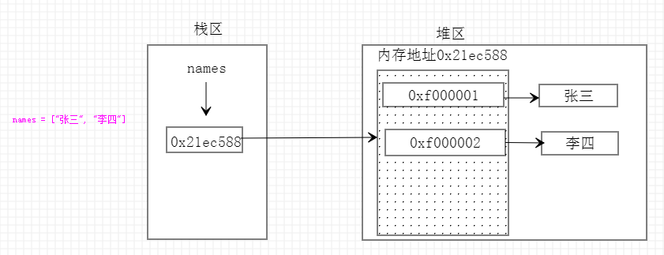

[toc]

# 按存储的值的个数区分

&emsp;&emsp;按照变量可以存储的值的个数可以分为：

+ <font color=green>**原子类型：**</font> 只能存储一个值，包括：数字类型和字符串类型
+ <font color=green>**容器类型：**</font> 可以存放多个值，包括：列表、字典、元祖和集合

```python
# 原子类型
number  =   12       # 数字类型 --- 整型
salary = 12.12      # 数字类型 --- 浮点型
name     =   "张三"  # 字符串类型

# 容器类型
names = ["张三", "李四"]        # 列表类型
infos = {"name": "张三", "age": 12}   # 字典类型
books = {"Python", "C#"}    # 集合类型
hobs = ("足球", "篮球")     # 元祖类型
```

# 按照访问方式区分

&emsp;&emsp;按照访问方式可以分为：

+ <font color=green>**直接访问：**</font> 只能通过变量名访问整个值，包括：数字
+ <font color=green>**顺序访问：**</font> 可以通过索引访问指定的值，包括：字符串、列表、元祖
+ <font color=green>**键值访问：**</font> 可以使用key访问到指定的值，包括：字典

```python
# 直接访问
number = 12       # 数字类型 --- 整型
print(number)     # 12
salary = 12.12      # 数字类型 --- 浮点型
print(salary)       # 12.12

# 顺序访问
# 字符串类型
name = "张三"  
print(name[0])  # 张
# 列表类型
names = ["张三", "李四"]        
print(names[0])     # 张三
# 元祖类型
hobs = ("足球", "篮球") 
print(hobs[0])      # 足球 

# key访问
infos = {"name": "张三", "age": 12}   # 字典类型
print(infos["name"])    # 张三
```

> <font color=orange>*__注意：__*</font> 集合类型既没有索引也没有key与值对应，所以集合无法取得单个的值，而且集合主要是用于去重与关系运算，根本没有取出单个指定值这种需求

# 按照可变不可变区分

+ <font color=green>**可变类型：**</font> 当值发生改变的时候内存地址不变（即id不变），这就证明在改变原值。包括：列表类型、字典类型和集合类型
+ <font color=green>**不可变类型：**</font> 值发生改变的时候内存地址也发生改变（即id也变），这就证明是没有在改变原值，而是产生了新的值。包括：数字类型、字符串类型和元祖类型

## 可变类型

<font color=orachid>**1. 列表类型**</font>

```python
names = ["张三", "李四"]
print(hex(id(names)))   # 0x21ec588
# 修改
names[0] = "王五"
print(hex(id(names)))   # 0x21ec588
# 添加
names.append("旺财")
print(hex(id(names)))   # 0x21ec588

# 对列表的值进行操作时，值改变但内存地址不变，所以列表是可变数据类型
```




<font color=orachid>**2. 字典类型**</font>

```python
info = {"name": "张三", "age": 18}
print(hex(id(info))) # 0x1db59d8
info["name"] = "李四"
print(hex(id(info))) # 0x1db59d8

# 对字典进行操作时，值改变的情况下字典的id也是不变的，即字典也是可变数据类型
```


<font color=orachid>**3. 集合类型**</font>

```python
books = {"Java", "Python"}
print(hex(id(books)))   # 0x2745128
books.add("C")
print(hex(id(books)))   # 0x2745128
```


> <font color=orange>*__注意：__*</font> 如果执行类似 <font color=red>**books = {"C"}**</font> 这样的语句，这是给变量重新赋值，会指定新的内存地址，这时候通过 id方法 获取到的值是会发生改变的。

## 不可变类型

<font color=orachid>**1. 数字类型**</font>

```python
x = 10 
print(id(x))    # 1804698000
x = 20
print(id(x))    # 1804698320
# 内存地址改变了，说明整型是不可变数据类型，浮点型也一样
```


<font color=orachid>**2. 字符串类型**</font>

```python
name = "张三" 
print(hex(id(name)))    # 0x216df50
name = "李四"
print(hex(id(name)))    # 0x21fb1e8

# 内存地址改变了，说明字符串是不可变数据类型
```


<font color=orachid>**3. 元祖**</font>

```python
t1 = ("tom", "jack", [1, 2])
# t1[0] = 'TOM'  # 报错：TypeError
# t1.append('lili')  # 报错：TypeError
# 元组内的元素无法修改，指的是元组内索引指向的内存地址不能被修改

print(hex(id(t1)), hex(id(t1[0])), hex(id(t1[1])), hex(id(t1[2])))  # 0x1e6dc60 0x1e791f0 0x1e79180 0x1e7c608

t1[2][0] = 111  # 如果元组中存在可变类型，是可以修改，但是修改后的内存地址不变
print(hex(id(t1)), hex(id(t1[0])), hex(id(t1[1])), hex(id(t1[2])))  # 0x1e6dc60 0x1e791f0 0x1e79180 0x1e7c608
```


