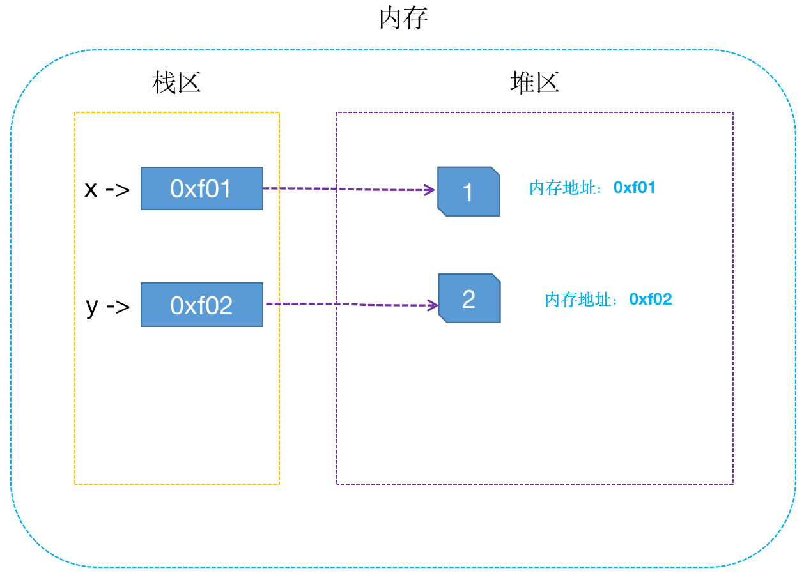
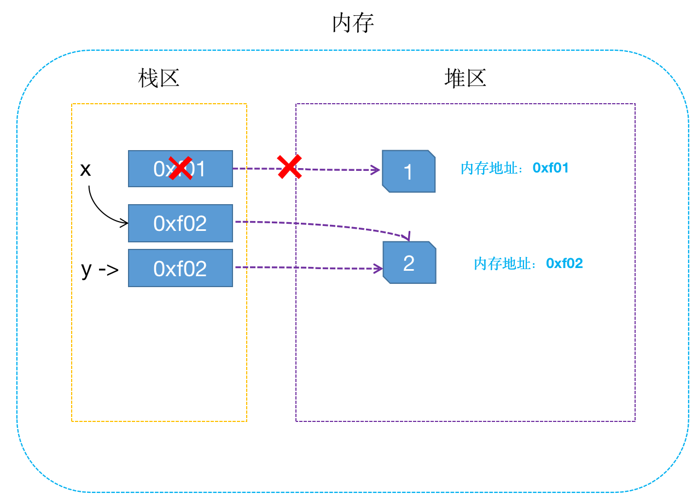
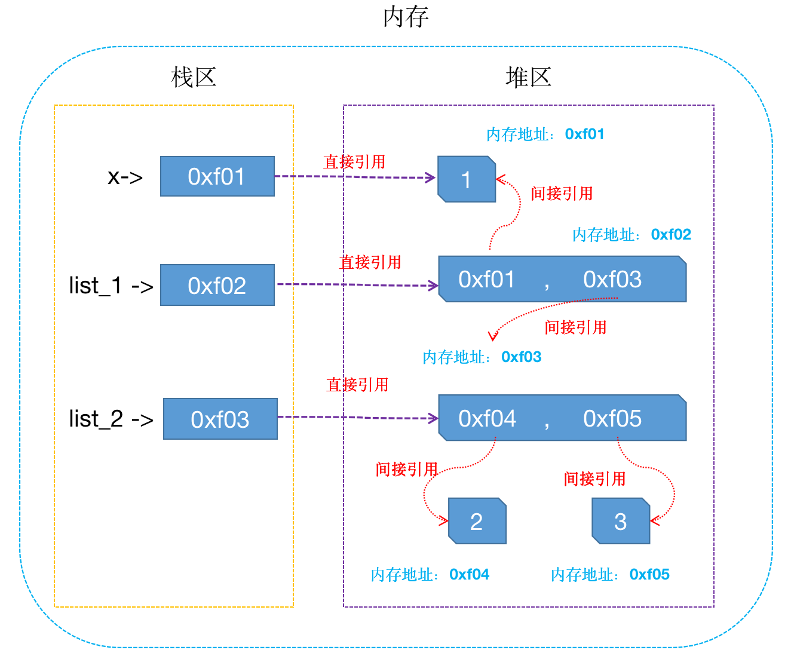
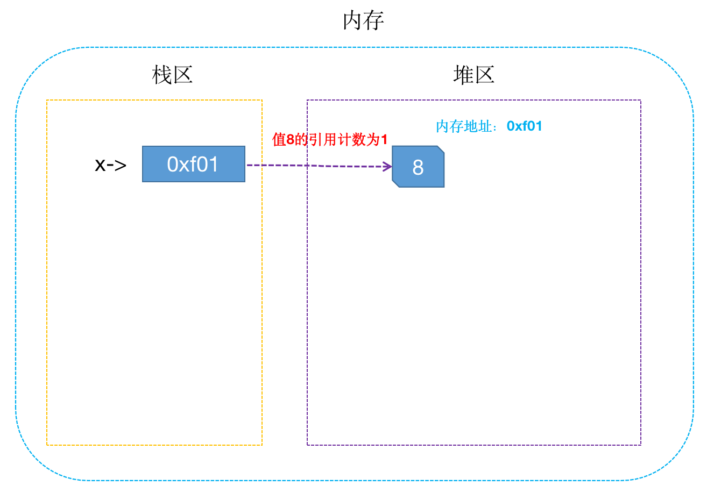
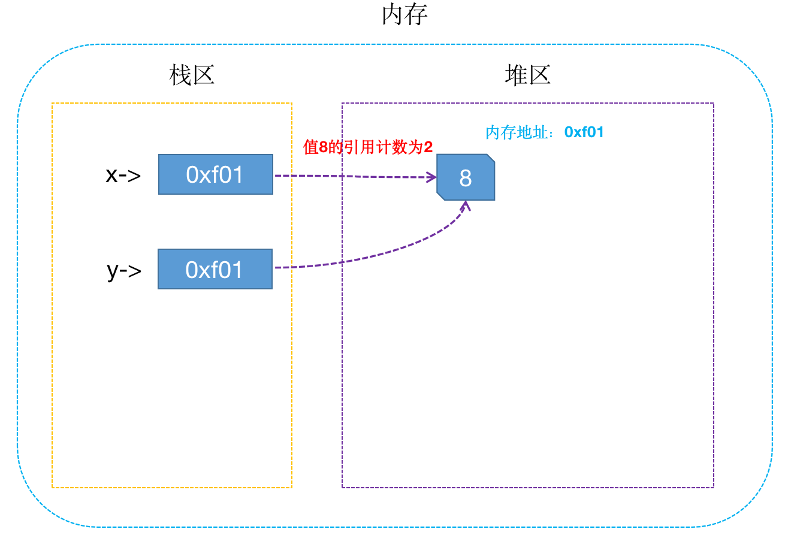
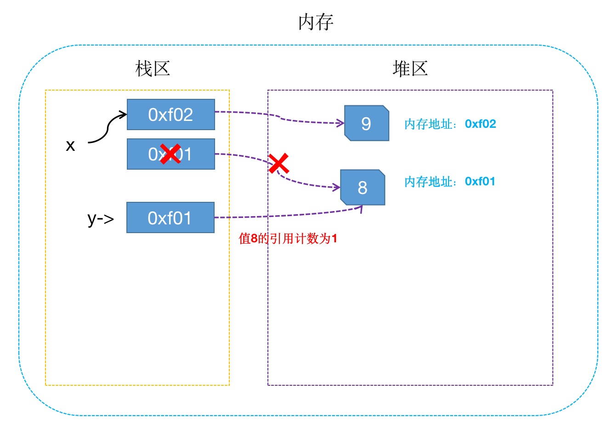
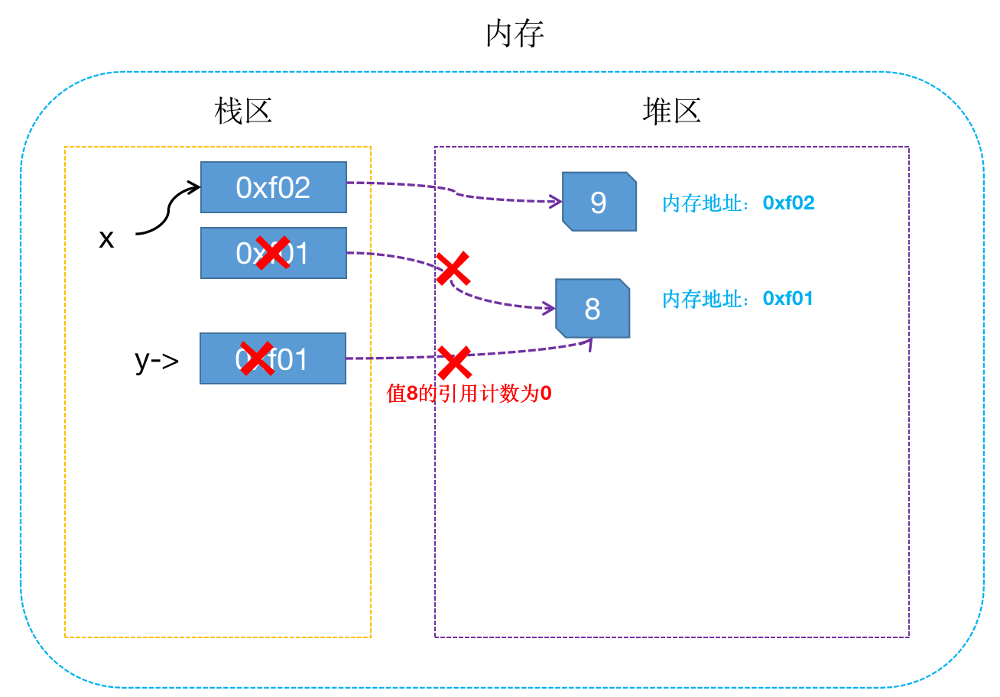
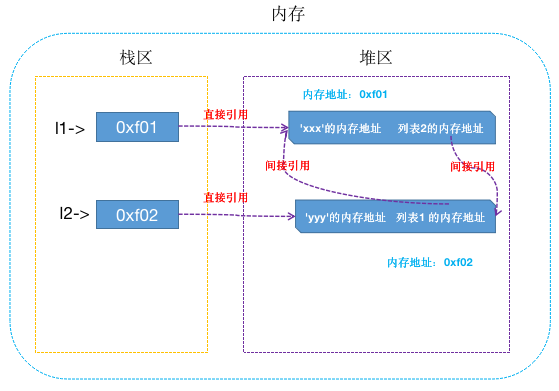
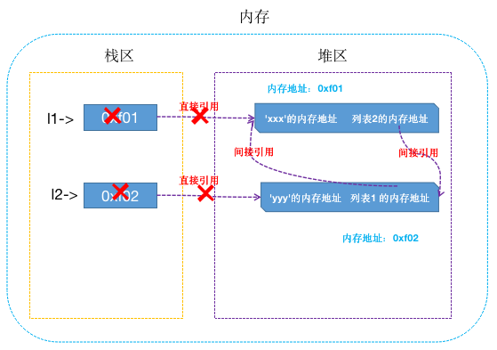
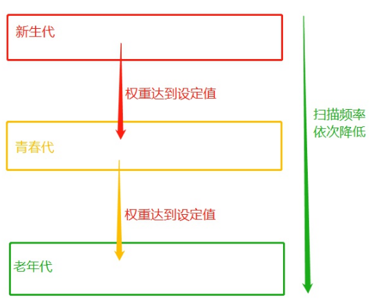

[toc]

# 基本概念

&emsp;&emsp;解释器在执行到定义变量的语法时会申请内存空间来存放变量的值，而内存的容量是有限的，这就涉及到变量值所占用内存空间的回收问题，当一个变量值没有用了（简称垃圾）就应该将其占用的内存给回收掉。

&emsp;&emsp;我们定义变量将变量值存起来的目的是为了以后取出来使用，而取得变量值需要通过其绑定的直接引用或间接引用，所以当一个变量值不再绑定任何引用时，我们就无法再访问到该变量值了，该变量值自然就是没有用的，就应该被当成一个垃圾回收。

## 垃圾回收机制

&emsp;&emsp;内存空间的申请与回收都是非常耗费精力的事情，而且存在很大的危险性，稍有不慎就有可能引发内存溢出问题。垃圾回收机制（<font color=red> *__简称GC__* </font>）是Python解释器自带的一种机制，专门用来回收不可用的变量值所占用的内存空间，从而可以把程序员从繁杂的内存管理中解放出来。

## 堆区和栈区

&emsp;&emsp;在定义变量时，变量名与变量值都是需要存储的，分别对应内存中的两块区域：

+ <font color=orchid>**栈区：**</font> 变量名与值内存地址的关联关系存放于栈区
+ <font color=orchid>**堆区：**</font> 变量值存放于堆区，内存管理回收的是堆区的内容
 
&emsp;&emsp;假设定义了两个变量<font color=red> **"x = 1、y = 2"** </font>，它们的存储方式如下图：



&emsp;&emsp;当执行<font color=red> **"x=y"** </font>时，内存中的栈区与堆区变化如下：



## 直接引用和间接引用

+ <font color=orchid>**直接引用：**</font> 从栈区出发直接引用到的内存地址
+ <font color=orchid>**间接引用：**</font> 从栈区出发引用到堆区后，再通过进一步引用才能到达的内存地址

&emsp;&emsp;比如下面的案例：

```python
# 列表本身被变量名l2直接引用，包含的元素被列表间接引用
list_2 = [2,  3]
# 值10被变量名x直接引用
x = 1
# 列表本身被变量名l1直接引用，包含的元素被列表间接引用
list_1 = [x, list_2]
```



# 垃圾回收机制原理

&emsp;&emsp;Python的GC模块主要运用了下面的技术：

+ <font color=orchid>**引用计数（reference counting）：**</font> 主要用来跟踪和回收垃圾
+ <font color=orchid>**标记-清除（mark and sweep）：**</font> 解决容器对象可能产生的循环引用的问题
+ <font color=orchid>**分代回收（generation collection）：**</font> 以空间换取时间的方式来进一步提高垃圾回收的效率

## 引用计数

&emsp;&emsp;引用计数就是变量值被变量名关联的次数，比如：

1. 如果执行<font color=red> **x = 8** </font>，此时值 8 的引用次数就为1：



1. 如果执行<font color=red> **y  =  x** </font>，这句代码的意思是将 x 的内存地址给 y，所以这个时候 x 和 y 都关联了8，这个时候变量值8的引用计数为2：



1. 如果执行<font color=red> **x  =  9** </font>，这个时候会先将 x 与值 8 解除关联，再将 x 与值 9 建立关联，此时值 8 的引用计数为1：



1. 如果执行<font color=red> **del y** </font>，del的意思是解除变量名与变量值的关联关系，此时变量 8 的引用计数为 0：



&emsp;&emsp;因为此时变量值 8 的引用计数为 0，所以它所占用的内存地址就应该被解释器垃圾回收机制回收。

## 标记-清除

&emsp;&emsp;引用计数机制存在着一个致命的弱点，即循环引用（也称交叉引用）：

```python
# 如下我们定义了两个列表
l1 = ['xxx']  # 列表1被引用一次，列表1的引用计数变为1 
l2 = ['yyy']  # 列表2被引用一次，列表2的引用计数变为1  
l1.append(l2)   # 把列表2追加到l1中作为第二个元素，列表2的引用计数变为2
l2.append(l1)   # 把列表1追加到l2中作为第二个元素，列表1的引用计数变为2
```



&emsp;&emsp;循环引用会导致虽然值不再被任何名字关联，但是值的引用计数并不会为 0，即应该被回收但却不能被回收。比如对上面的两个列表执行下面的操作：

```python
del l1 # 列表1的引用计数减1，列表1的引用计数变为1
del l2 # 列表2的引用计数减1，列表2的引用计数变为1
```

&emsp;&emsp;此时，只剩下列表1与列表2之间的相互引用：



&emsp;&emsp;这个时候虽然两个列表的引用计数均不为0，但它们不再被任何其它对象关联，即没有任何人可以再引用到它们，所以它俩占用内存空间应该被回收。可是由于相互引用的存在，导致它们的引用计数都不为0，所以这些对象所占用的内存永远不会被释放。

&emsp;&emsp;循环引用是致命的，容器对象（比如：list，set，dict，class，instance）都可以包含对其它对象的引用，所以都可能产生循环引用。而<font color=red> *__“标记-清除”__* </font>就是为了解决循环引用的问题，它的做法是当应用程序可用的内存空间被耗尽的时候就会停止整个程序，然后进行两项工作：标记和清除：

+ <font color=orchid>**标记：**</font> 遍历所有的GC Roots对象（栈区中的所有内容或者线程都可以作为GC Roots对象），然后将所有GC Roots的对象可以直接或间接访问到的对象标记为存活的对象，其余的均为非存活对象，应该被清除
+ <font color=orchid>**清除：**</font> 清除的过程将遍历堆中所有的对象，将没有标记的对象全部清除掉
 
&emsp;&emsp;基于上例的循环引用，当同时删除 l1 和 l2 时就会清理栈区中 l1 与 l2 的内容以及直接引用关系。这样在启用标记清除算法时，从栈区出发就没有任何一条直接或间接引用可以访达 l1 与 l2，于是 l1 与 l2 都没有被标记为存活，二者会都被清理掉，这样就解决了循环引用带来的内存泄漏问题。

## 分代回收

&emsp;&emsp;基于引用计数的回收机制，每次回收内存都需要把所有对象的引用计数遍历一遍，这是非常消耗时间的。于是引入了分代回收来提高回收效率，分代回收采用的是<font color=red> *__“空间换时间”__* </font>的策略。
        
&emsp;&emsp;分代回收的核心思想是<font color=red> *__在历经多次扫描的情况下都没有被回收的变量，gc机制就会认为该变量是常用变量，并且降低对其扫描的频率__* </font>，也就是说分代是根据存活时间来为变量划分不同等级（不同的代）。具体实现原理如下：

+ 新定义的变量，放到新生代这个等级中
+ 每隔一段时间扫描新生代一次，如果发现变量依然被引用，那么该对象的权重加一，当变量的权重大于某个特定得值的时候就会将它移动到更高一级的青春代
+ 青春代的gc扫描的频率低于新生代（扫描时间间隔更长），这样每次gc需要扫描的变量的总个数就变少了，节省了扫描的总时间
+ 青春代中的对象也会以同样的方式被移动到老年代中
+ 也就是说等级（代）越高，被垃圾回收机制扫描的频率越低



&emsp;&emsp;分代回收的回收依然是使用引用计数作为回收的依据，所以垃圾回收机制就是在清理垃圾和释放内存的大背景下，允许分代回收以极小部分垃圾不会被及时释放为代价，以此换取引用计数整体扫描频率的降低，从而提升其性能，这是一种以空间换时间的解决方案。

> <font color=orange>*__注意：__*</font> 虽然分代回收可以起到提升效率的效果，但也存在一定的缺点：例如一个变量刚刚从新生代移入青春代，该变量的绑定关系就解除了，该变量应该被回收。但青春代的扫描频率低于新生代，这就到导致了应该被回收的垃圾没有得到及时地清理，所以没有十全十美的方案。